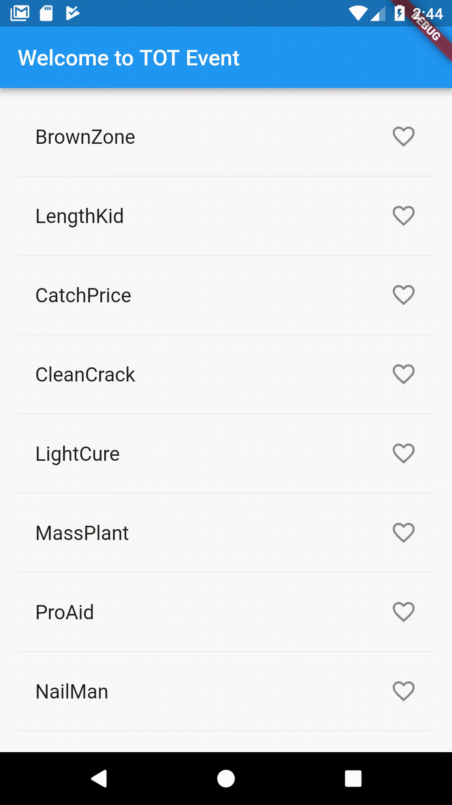

# TOT Event

## Flutter Study Jam - Code Lab

### Description

Code First Flutter App, part 1 & part 2:
- [ListView](https://docs.flutter.io/flutter/widgets/ListView-class.html)
- [ListTile](https://docs.flutter.io/flutter/material/ListTile-class.html)
- [Scaffold](https://docs.flutter.io/flutter/material/Scaffold-class.html)
- [Icon](https://docs.flutter.io/flutter/material/Icons-class.html)

##Part1

### Getting Started
1. Setup Flutter ( [check here ](https://flutter.io/get-started/install/))

2. Download this source code.

3. Enjoy !!

### Resources
For help getting started with Flutter, you can check those resources
- [Official documentation](https://flutter.io/).

- [Start Flutter](https://startflutter.com/).

- [Flutter at Gitter](https://gitter.im/flutter/flutter).

- [Flutter packages](https://pub.dartlang.org/flutter).

- [Awesome Flutter github repo](https://github.com/Solido/awesome-flutter).

